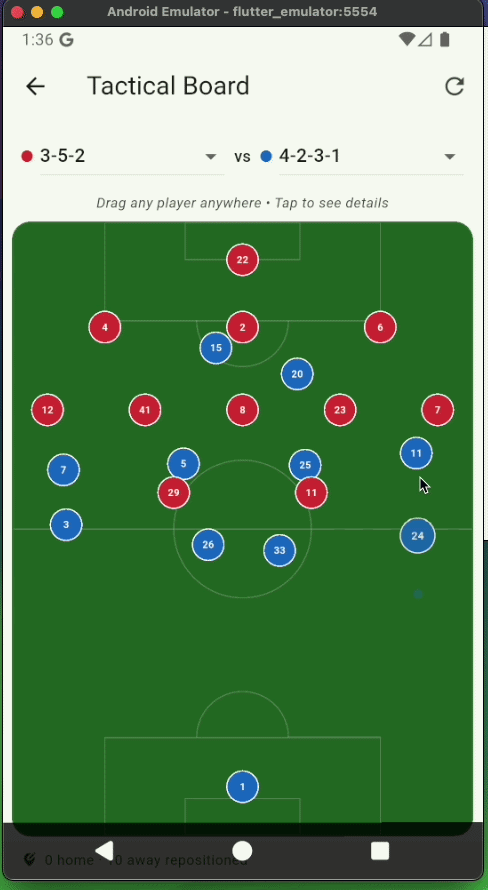
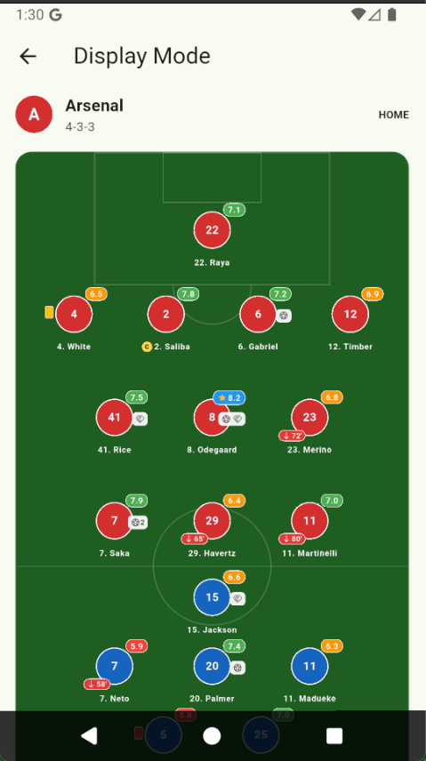
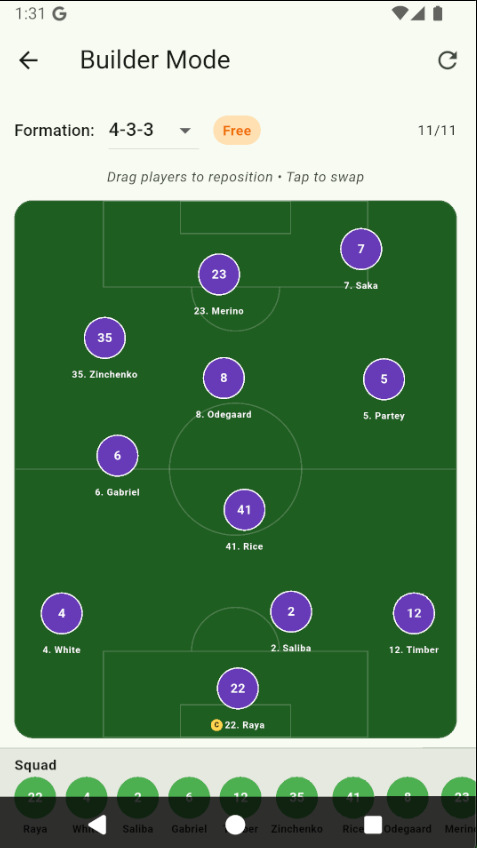
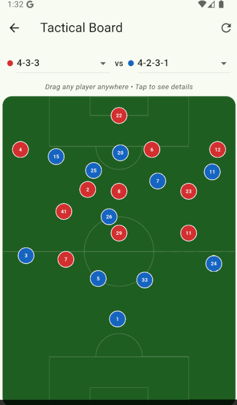

# lineup_builder

A reusable Flutter package for rendering football/soccer lineup formations on a pitch. Fully isolated from app-specific models — bring your own data, map it to `LineupPlayer`, and render.

## Demo



## Screenshots

| Display Mode | Builder Mode | Tactical Board |
|:---:|:---:|:---:|
|  |  |  |

## Features

- **Display mode** — Render match lineups with player stats (rating, goals, assists, cards, substitutions)
- **Builder mode** — Drag-and-drop lineup builder for custom formations with drag trail effect
- **Tactical mode** — Two-team tactical board where all players can be dragged anywhere
- **Animated transitions** — Smooth position animation when formations change
- **Drag trail** — Meteor-like trail from start position to current drag position
- **Haptic feedback** — Configurable haptic on drag start (light, medium, heavy, selection, vibrate)
- **Customizable** — Override pitch colors, sizes, player node rendering

## Installation

```yaml
dependencies:
  lineup_builder:
    git:
      url: https://github.com/oohyugi/lineup_builder.git
```

## Quick Start

```dart
import 'package:lineup_builder/lineup_builder.dart';
```

### Display Mode (Two Teams)

```dart
LineupBuilder.display(
  homeTeam: LineupTeam(
    name: 'Arsenal',
    formation: '4-3-3',
    shirtColor: Colors.red,
    players: [
      LineupPlayer(id: 1, number: 22, position: PlayerPosition.goalkeeper, name: 'Raya'),
      LineupPlayer(id: 2, number: 4, position: PlayerPosition.defender, name: 'White'),
      // ...
    ],
  ),
  awayTeam: chelseaTeam,
  onPlayerTap: (player) => print(player.name),
)
```

### Single Team (Full Pitch)

```dart
LineupBuilder.single(team: arsenalTeam)
```

### Builder Mode (Drag & Drop)

```dart
LineupBuilder.editable(
  team: myTeam,
  onPlayerTap: (player) => swapPlayer(player),
  onPositionsChanged: (positions) => saveFormation(positions),
  onFormationChanged: (f) => print(f), // "Free" after drag
  haptic: const HapticConfig(type: HapticType.medium),
)
```

### Tactical Board (Two-Team Analysis)

```dart
LineupBuilder.tactical(
  homeTeam: arsenalTeam,
  awayTeam: chelseaTeam,
  onTacticalPlayerTap: (ref) {
    print('${ref.player.name} (${ref.side})');
  },
  onTacticalPositionsChanged: (positions) {
    // positions.homePositions + positions.awayPositions
  },
)
```

## Configuration

```dart
LineupBuilder.editable(
  team: myTeam,
  config: LineupPitchConfig(
    pitchColor: Colors.green.shade900,
    pitchHeight: 600,
    playerAvatarSize: 32,
    borderRadius: 12,
  ),
  haptic: const HapticConfig(
    enabled: true,
    type: HapticType.light,
  ),
)
```

## Custom Player Node

```dart
LineupBuilder.display(
  homeTeam: myTeam,
  playerNodeBuilder: (player, shirtColor) {
    return MyCustomPlayerWidget(player: player);
  },
)
```

## Models

| Model | Description |
|-------|-------------|
| `LineupPlayer` | Player data (name, number, position, stats) |
| `LineupTeam` | Team data (name, formation, players, shirt color) |
| `LineupPitchConfig` | Visual configuration (colors, sizes, padding) |
| `HapticConfig` | Haptic feedback settings |
| `PlayerPosition` | Enum: goalkeeper, defender, midfielder, forward |

## Widgets

| Widget | Description |
|--------|-------------|
| `LineupBuilder` | Main entry point with `.display`, `.single`, `.editable`, `.tactical` |
| `LineupPitch` | Lower-level read-only pitch widget |
| `DraggableLineupPitch` | Lower-level draggable pitch (single team) |
| `TacticalBoardPitch` | Lower-level two-team draggable board |
| `PlayerNode` | Individual player avatar with stat badges |
| `PitchPainter` | CustomPainter for pitch markings |

## Drag Interaction

- **On drag start**: Haptic feedback + scale up (1.1×)
- **During drag**: Trail line from start to current position (gradient fade)
- **On drag end**: Trail disappears, position saved
- **Formation change**: Players animate smoothly to new positions (300ms easeOutCubic)

## License

MIT
